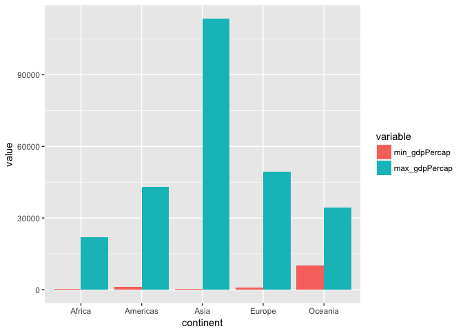
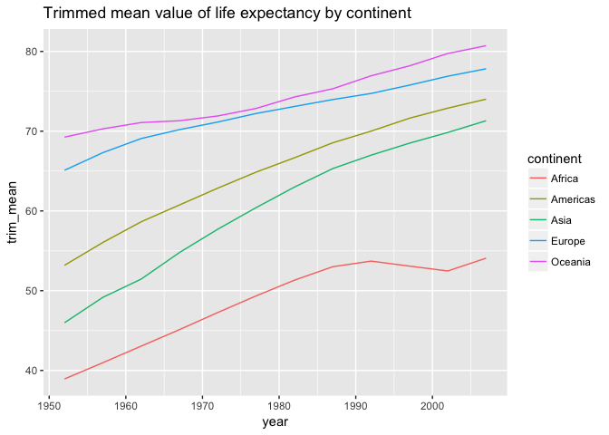

STAT545 Homework 03 The use of dplyr/ggplot2
================

<style type="text/css">
.twoC {width: 100%}
.clearer {clear: both}
.twoC .table {max-width: 50%; float: right}
.twoC img {max-width: 50%; float: left}
</style>

## Overview

This Rmarkdown file aims to explore the gapminder dataset with **dplyr**
package, and to plot figures using **ggplot2** package. It will be used
as a cheatsheet for future data manipulation and figure plotting.

## Import data frame and tidyverse pacakge

Gapminder data will be used in this homework, and the dataset will be
explored using “dplyr” package.

``` r
library(gapminder)
library(dplyr)
```

    ## 
    ## Attaching package: 'dplyr'

    ## The following objects are masked from 'package:stats':
    ## 
    ##     filter, lag

    ## The following objects are masked from 'package:base':
    ## 
    ##     intersect, setdiff, setequal, union

``` r
library(ggplot2)
library(reshape2)
# use suppressMessages(library(tidyverse)) to generate a pdf file
```

## Task 1 Get the maximum and minimum of GDP per capita for all continents.

To get the maximum and minimum value of GDP per capita for all
continents, the data need to be group by continent, and then get the min
and max value by calling **summarize** function.

``` r
min_max <- gapminder %>% 
  group_by(continent) %>% 
  summarize(min_gdpPercap = min(gdpPercap),
            max_gdpPercap = max(gdpPercap))
```

The following chunk makes the table looks better.

``` r
knitr::kable(min_max)
```

| continent | min\_gdpPercap | max\_gdpPercap |
| :-------- | -------------: | -------------: |
| Africa    |       241.1659 |       21951.21 |
| Americas  |      1201.6372 |       42951.65 |
| Asia      |       331.0000 |      113523.13 |
| Europe    |       973.5332 |       49357.19 |
| Oceania   |     10039.5956 |       34435.37 |

In order to plot the min and max value, the data.frame needs to be
reshaped. The following chunk will put the value of max and min in one
column and lable the value in another column named variable. I found
this
[webpage](https://stackoverflow.com/questions/9531904/plot-multiple-columns-on-the-same-graph-in-r)
helpful.

``` r
min_max <- melt(min_max, id.vars = "continent")
```

The following chunk will produce a barplot. To plot the value of min and
max side by side, I used position = position\_dodge(.9), which is
learned from
[here](http://kweatherholtz.github.io/blog/intro-to-ggplot/).

``` r
min_max %>% 
  ggplot(aes(continent, value)) +
  geom_bar(stat = "identity", position = position_dodge(.9), aes(fill = variable))
```

<!-- -->

The table and the plot show the mininum and maxmum gdp per capita of
each continent.

The first part of this task is not hard, but I spent a lot of time on
the second part. I cannot get the correct barplot before I learned how
to reshape the data.frame. I found the **reshape2** package very helpful
here.

## Task 2 Compute a trimmed mean of life expectancy of different continent for different years

To get the trimmed mean value of the lifeExp, the value of trim needs to
be specified in the mead() funtion.

``` r
t_mean <- gapminder %>% 
  group_by(year, continent) %>% 
  summarize(trim_mean_lifeExp = mean(lifeExp, trim = 0.1))
```

``` r
knitr::kable(t_mean)
```

| year | continent | trim\_mean\_lifeExp |
| ---: | :-------- | ------------------: |
| 1952 | Africa    |            38.93298 |
| 1952 | Americas  |            53.18157 |
| 1952 | Asia      |            45.98107 |
| 1952 | Europe    |            65.09708 |
| 1952 | Oceania   |            69.25500 |
| 1957 | Africa    |            40.96993 |
| 1957 | Americas  |            56.04624 |
| 1957 | Asia      |            49.16422 |
| 1957 | Europe    |            67.30763 |
| 1957 | Oceania   |            70.29500 |
| 1962 | Africa    |            43.04819 |
| 1962 | Americas  |            58.64005 |
| 1962 | Asia      |            51.45357 |
| 1962 | Europe    |            69.07921 |
| 1962 | Oceania   |            71.08500 |
| 1967 | Africa    |            45.11750 |
| 1967 | Americas  |            60.75086 |
| 1967 | Asia      |            54.78682 |
| 1967 | Europe    |            70.19675 |
| 1967 | Oceania   |            71.31000 |
| 1972 | Africa    |            47.26495 |
| 1972 | Americas  |            62.86081 |
| 1972 | Asia      |            57.71233 |
| 1972 | Europe    |            71.14942 |
| 1972 | Oceania   |            71.91000 |
| 1977 | Africa    |            49.34983 |
| 1977 | Americas  |            64.86633 |
| 1977 | Asia      |            60.41761 |
| 1977 | Europe    |            72.22067 |
| 1977 | Oceania   |            72.85500 |
| 1982 | Africa    |            51.31998 |
| 1982 | Americas  |            66.66624 |
| 1982 | Asia      |            62.99337 |
| 1982 | Europe    |            73.09983 |
| 1982 | Oceania   |            74.29000 |
| 1987 | Africa    |            53.00740 |
| 1987 | Americas  |            68.54767 |
| 1987 | Asia      |            65.31263 |
| 1987 | Europe    |            73.96738 |
| 1987 | Oceania   |            75.32000 |
| 1992 | Africa    |            53.71045 |
| 1992 | Americas  |            70.00586 |
| 1992 | Asia      |            66.99396 |
| 1992 | Europe    |            74.73196 |
| 1992 | Oceania   |            76.94500 |
| 1997 | Africa    |            53.08371 |
| 1997 | Americas  |            71.62719 |
| 1997 | Asia      |            68.49633 |
| 1997 | Europe    |            75.77375 |
| 1997 | Oceania   |            78.19000 |
| 2002 | Africa    |            52.47467 |
| 2002 | Americas  |            72.88752 |
| 2002 | Asia      |            69.83704 |
| 2002 | Europe    |            76.88962 |
| 2002 | Oceania   |            79.74000 |
| 2007 | Africa    |            54.07752 |
| 2007 | Americas  |            74.01419 |
| 2007 | Asia      |            71.31067 |
| 2007 | Europe    |            77.82504 |
| 2007 | Oceania   |            80.71950 |

The following chunk will a line plot of the change.

``` r
t_mean %>% 
  ggplot(aes(year, trim_mean_lifeExp, col = continent)) +
  geom_line()
```

<!-- -->

The table and the plot show the trimmed mean value of life expectancy of
different continent over time.

This task is quite straight forwards, and the pattern in clearly shown
by the
plot.

## Task 3 Report countries that has relative low life expectancy over time by continent.

The reletive low life expectancy is defined as life expectancy lower
than the mean of the worldwide life expectancy. First, the mean of the
worldwide life expectancy (life expectancy benchmark) needs to be
computed.

``` r
gm_worldmean_lifeExp <- gapminder %>% 
  group_by(year) %>% 
  mutate(lifeExp_benchmark = mean(lifeExp))
```

Then count the number of countries of each continent that has a small
life expectancy value than the worldwide one for each year.

``` r
num_lowExp_country <- gm_worldmean_lifeExp %>% 
  mutate(rel_low = lifeExp < lifeExp_benchmark) %>% 
  group_by(year, continent) %>% 
  summarize(n_country = sum(rel_low == "TRUE"))
```

``` r
knitr::kable(num_lowExp_country)
```

| year | continent | n\_country |
| ---: | :-------- | ---------: |
| 1952 | Africa    |         50 |
| 1952 | Americas  |          9 |
| 1952 | Asia      |         22 |
| 1952 | Europe    |          1 |
| 1952 | Oceania   |          0 |
| 1957 | Africa    |         50 |
| 1957 | Americas  |          9 |
| 1957 | Asia      |         20 |
| 1957 | Europe    |          1 |
| 1957 | Oceania   |          0 |
| 1962 | Africa    |         50 |
| 1962 | Americas  |          8 |
| 1962 | Asia      |         19 |
| 1962 | Europe    |          1 |
| 1962 | Oceania   |          0 |
| 1967 | Africa    |         50 |
| 1967 | Americas  |          6 |
| 1967 | Asia      |         18 |
| 1967 | Europe    |          1 |
| 1967 | Oceania   |          0 |
| 1972 | Africa    |         50 |
| 1972 | Americas  |          6 |
| 1972 | Asia      |         18 |
| 1972 | Europe    |          1 |
| 1972 | Oceania   |          0 |
| 1977 | Africa    |         49 |
| 1977 | Americas  |          7 |
| 1977 | Asia      |         14 |
| 1977 | Europe    |          1 |
| 1977 | Oceania   |          0 |
| 1982 | Africa    |         48 |
| 1982 | Americas  |          7 |
| 1982 | Asia      |         12 |
| 1982 | Europe    |          1 |
| 1982 | Oceania   |          0 |
| 1987 | Africa    |         46 |
| 1987 | Americas  |          5 |
| 1987 | Asia      |         12 |
| 1987 | Europe    |          1 |
| 1987 | Oceania   |          0 |
| 1992 | Africa    |         46 |
| 1992 | Americas  |          3 |
| 1992 | Asia      |         11 |
| 1992 | Europe    |          0 |
| 1992 | Oceania   |          0 |
| 1997 | Africa    |         45 |
| 1997 | Americas  |          2 |
| 1997 | Asia      |         10 |
| 1997 | Europe    |          0 |
| 1997 | Oceania   |          0 |
| 2002 | Africa    |         45 |
| 2002 | Americas  |          2 |
| 2002 | Asia      |         10 |
| 2002 | Europe    |          0 |
| 2002 | Oceania   |          0 |
| 2007 | Africa    |         45 |
| 2007 | Americas  |          2 |
| 2007 | Asia      |         10 |
| 2007 | Europe    |          0 |
| 2007 | Oceania   |          0 |

The following chunk plot a figure showing the number of low life
expectancy countries of each continent over time.

``` r
num_lowExp_country %>% 
  ggplot(aes(year, n_country, col = continent)) +
  geom_line()
```

<!-- -->

The table and the plot show the number of countries that has a
relatively low life expectancy in each continent over time.

I found the first part of this task very difficult. It was hard for me
to count the number of countries that has a relatively low life
expectancy until I got some help from
[here](https://stackoverflow.com/questions/36580093/sum-a-column-based-on-condition-in-another-column-in-r).

## But I want to explore more

The following chunks will put the table and plot side by side, but only
when the output is a html\_document file. You can check this page
(<http://rpubs.com/yadong_liu/424706>) to see how it works. I was
inspired by this [webpage](http://rpubs.com/jennybc/plot-next-to-table).

``` r
t_mean <- gapminder %>% 
  group_by(year, continent) %>% 
  summarize(trim_mean = mean(lifeExp, trim = 0.1))
```

<div class="twoC">

``` r
knitr::kable(t_mean)
```

| year | continent | trim\_mean |
| ---: | :-------- | ---------: |
| 1952 | Africa    |   38.93298 |
| 1952 | Americas  |   53.18157 |
| 1952 | Asia      |   45.98107 |
| 1952 | Europe    |   65.09708 |
| 1952 | Oceania   |   69.25500 |
| 1957 | Africa    |   40.96993 |
| 1957 | Americas  |   56.04624 |
| 1957 | Asia      |   49.16422 |
| 1957 | Europe    |   67.30763 |
| 1957 | Oceania   |   70.29500 |
| 1962 | Africa    |   43.04819 |
| 1962 | Americas  |   58.64005 |
| 1962 | Asia      |   51.45357 |
| 1962 | Europe    |   69.07921 |
| 1962 | Oceania   |   71.08500 |
| 1967 | Africa    |   45.11750 |
| 1967 | Americas  |   60.75086 |
| 1967 | Asia      |   54.78682 |
| 1967 | Europe    |   70.19675 |
| 1967 | Oceania   |   71.31000 |
| 1972 | Africa    |   47.26495 |
| 1972 | Americas  |   62.86081 |
| 1972 | Asia      |   57.71233 |
| 1972 | Europe    |   71.14942 |
| 1972 | Oceania   |   71.91000 |
| 1977 | Africa    |   49.34983 |
| 1977 | Americas  |   64.86633 |
| 1977 | Asia      |   60.41761 |
| 1977 | Europe    |   72.22067 |
| 1977 | Oceania   |   72.85500 |
| 1982 | Africa    |   51.31998 |
| 1982 | Americas  |   66.66624 |
| 1982 | Asia      |   62.99337 |
| 1982 | Europe    |   73.09983 |
| 1982 | Oceania   |   74.29000 |
| 1987 | Africa    |   53.00740 |
| 1987 | Americas  |   68.54767 |
| 1987 | Asia      |   65.31263 |
| 1987 | Europe    |   73.96738 |
| 1987 | Oceania   |   75.32000 |
| 1992 | Africa    |   53.71045 |
| 1992 | Americas  |   70.00586 |
| 1992 | Asia      |   66.99396 |
| 1992 | Europe    |   74.73196 |
| 1992 | Oceania   |   76.94500 |
| 1997 | Africa    |   53.08371 |
| 1997 | Americas  |   71.62719 |
| 1997 | Asia      |   68.49633 |
| 1997 | Europe    |   75.77375 |
| 1997 | Oceania   |   78.19000 |
| 2002 | Africa    |   52.47467 |
| 2002 | Americas  |   72.88752 |
| 2002 | Asia      |   69.83704 |
| 2002 | Europe    |   76.88962 |
| 2002 | Oceania   |   79.74000 |
| 2007 | Africa    |   54.07752 |
| 2007 | Americas  |   74.01419 |
| 2007 | Asia      |   71.31067 |
| 2007 | Europe    |   77.82504 |
| 2007 | Oceania   |   80.71950 |

<!-- -->

</div>

<div class="clearer">

</div>
